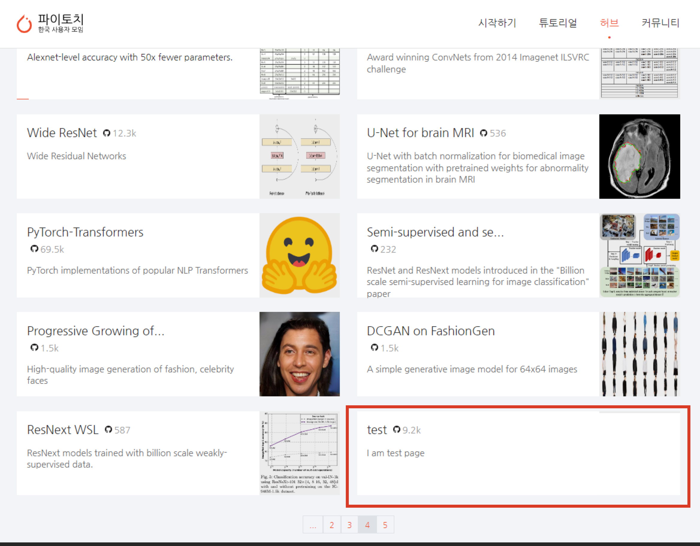

# PyTorch Korea 에 모델 게시하기

본 페이지는 사전 학습된 모델을 hub를 통해 배포하는 방법과 배포된 모델을 [Pytorch Korea](https://pytorch.kr/hub/)의 모델 안내 페이지에 추가하는 방법을 안내합니다.

## 1.  `torch.hub` 를 통해 모델 배포하기

`torch.hub`는 연구 재현 및 사용을 용이하게 하기 위해 설계된 사전 훈련된 모델 저장소입니다.

### 1.1. 모델 퍼블리싱

Pytorch Hub는 `hubconf.py`를 추가하여 사전 훈련된 모델(모델 정의 및 사전 훈련된 가중치)을 깃허브 저장소에 게시할 수 있도록 지원합니다.

`hubconf.py`는 여려 개의 엔트리 포인트(entry point)를 가질 수 있습니다. 각 엔트리 포인트들은 파이썬 함수로 정의됩니다. (예를 들어, 사용자가 등록하고자 하는 사전 훈련된 모델)

```python
def entrypoint_name(*args, **kwargs):
    # args & kwargs are optional, for models which take positional/keyword arguments.
    ...
```


### 1.2. 실행하는 방법

다음은 `pytorch/vision/hubconf.py`을 참고하여 작성한 `resnet18` 모델의 엔트리 포인트를 지정하는 코드입니다.
대부분의 경우 `hubconf.py`의 구현된 기능을 가져오면 충분합니다.
여기에서 확장 버전을 예시로 작동 방식을 보여드리겠습니다.
[pytorch/vision repo](https://github.com/pytorch/vision/blob/main/hubconf.py) 여기서 모든 스크립트를 볼 수 있습니다.

```python
dependencies = ['torch']
from torchvision.models.resnet import resnet18 as _resnet18


# resnet18은 엔트리 포인트의 이름입니다.
def resnet18(pretrained=False, **kwargs):
""" # 이 문서 문자열은  hub.help() Resnet18 model 안에서 보여줍니다
	사전 교육 (bool) : kwwargs, load pretrained weights를 모델에 적용합니다
"""

    # 모델을 불러오고 사전 학습된 가중치를 로드
    model = _resnet18(pretrained=pretrained, **kwargs)
    return model
```

`dependencies` 변수는 모델을 불러오는 데 필요한 패키지 이름을 담은 목록입니다. 이는 모델 학습에 필요한 종속성과는 약간 다를 수 있음을 주의하세요.
`args`와 `kwargs`는 실제 호출 가능한 함수로 전달됩니다.
함수의 Docstring은 도움 메시지의 역할을 합니다. 모델의 기능과 허용된 위치/키워드 인수에 대해 설명합니다. 여기에 몇 가지 예시를 추가하는 것이 좋습니다.
엔트리 포인트 함수는 모델(nn.module)을 리턴하거나 작업 흐름을 보다 부드럽게 만들기 위한 보조 도구(예: tokenizer)를 반환할 수 있습니다.
밑줄이 앞에 붙은 callables는 torch.hub.list()에 표시되지 않는 도우미 함수로 간주됩니다.
사전 훈련된 가중치는 깃허브 저장소에 로컬로 저장되거나 `torch.hub.load_state_dict_from_url()`을 사용해 불러올 수 있습니다. 크기가 2GB 미만일 경우 [project release](https://docs.github.com/en/repositories/working-with-files/managing-large-files/about-large-files-on-github)에 첨부하고 릴리스의 URL을 사용하는 것을 권장합니다. 위의 예시에서는 `torchvision.models.resnet.resnet18`이  `pretrained`를 다루지만, 해당 로직을 엔트리 포인트 정의에 넣는 방법을 사용할 수도 있습니다.

```
if pretrained:
	#체크 포인트로 로컬 깃허브 저장소, 예를 들면 <RELATIVE_PATH_TO_CHECKPOINT>=weights/save.pth에 저장합니다
    dirname = os.path.dirname(__file__)
    checkpoint = os.path.join(dirname, <RELATIVE_PATH_TO_CHECKPOINT>)
    state_dict = torch.load(checkpoint)
    model.load_state_dict(state_dict)

   # 체크 포인트가 다른 곳에 저장된 경우
    checkpoint = 'https://download.pytorch.org/models/resnet18-5c106cde.pth'
    model.load_state_dict(torch.hub.load_state_dict_from_url(checkpoint, progress=False))
```

**주의 사항**
배포된 모델들은 적어도 branch/tag에 속해야 합니다. 랜덤 커밋이 되면 안됩니다.

## 2. [Pytorch Korea](https://pytorch.kr/hub/) 에 모델 안내 페이지 추가하기

	- `torch.hub` 를 배포한 이후 해당 모델에 대한 안내 페이지를 pytorch.kr 에 모델 안내 페이지 추가하기

### 2.1. 페이지 작성하기

#### 2.1.1. 본 저장소 루트에 파일 생성하기

```bash
touch ${project_root}/sample.md
```

#### 2.1.2. [template.md](https://github.com/PyTorchKorea/hub-kr/blob/master/docs/template.md) 를 참조하여 파일 작성하기

### 2.2. 결과 확인하기

### 2.2.1. [빌드하기](https://github.com/PyTorchKorea/hub-kr#빌드하기) 를 참조하여 홈페이지를 빌드

### 2.2.2. 이후에 https://127.0.0.1:4000/hub/ 에서 추가된 페이지를 확인하기

다음과 같은 페이지를 확인하실 수 있습니다.


### 2.3. 기여하기

 추가한 페이지는 [기여하기](https://github.com/PyTorchKorea/hub-kr/blob/master/CONTRIBUTING.md) 를 참고하여 본 레포지터리에 기여해주세요!
